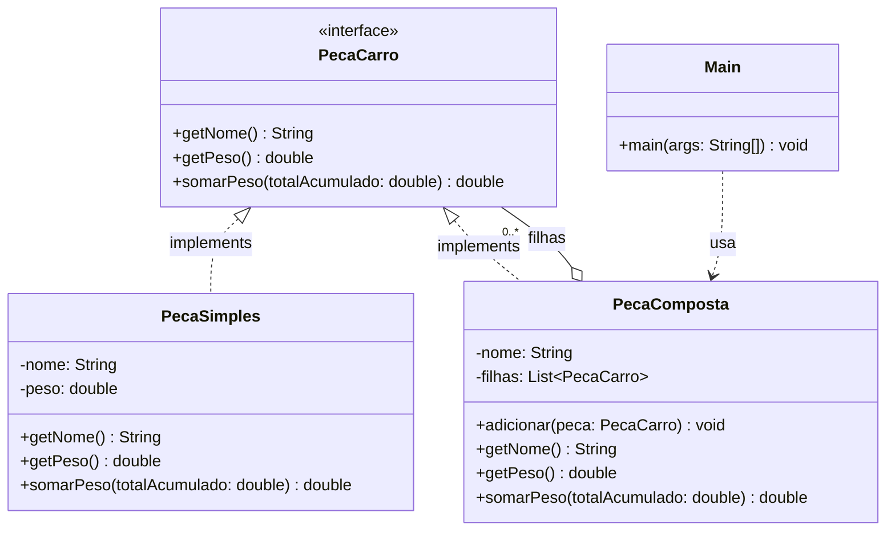

# Padrão Composite — Cálculo de Peso de um Carro

Disciplina: Padrões de Projetos Orientados a Objetos — IFPE Campus Belo Jardim
Atividade: Lista de Exercícios Avaliativa I — Questão 5 (Composite)

## Enunciado

Um carro é composto por uma carroceria e um chassi. A carroceria é composta por
para-lamas, portas, painéis, porta-malas e capô. Já o chassi é composto por um
trem de força e suspensão. Por fim, o trem de força é composto por um motor,
transmissão, diferencial e rodas. Essas diferentes partes de um carro apresentam
como características nome e peso.

O objetivo é usar o padrão **Composite** para desenhar um diagrama de classes e
codificar um programa que calcula o peso total do carro, imprimindo o processo
de soma parte a parte.

## Por que Composite?

O carro é uma estrutura em árvore: algumas partes agrupam outras partes
(Carro, Carroceria, Chassi, Trem de força), enquanto outras são peças
individuais sem subpartes (Motor, Rodas, Para-lamas etc.). Todas, porém,
compartilham as mesmas características exigidas pelo enunciado: **nome** e
**peso**. O Composite resolve exatamente esse cenário, permitindo tratar
objeto individual (Leaf) e composição de objetos (Composite) de forma
uniforme, através de uma interface comum.

## Diagrama de classes



- **`PecaCarro`** — o *Component*: interface comum a qualquer parte do carro.
- **`PecaSimples`** — o *Leaf*: peça individual, sem subpartes (ex. Motor, Rodas, Para-lamas).
- **`PecaComposta`** — o *Composite*: agrupamento de outras `PecaCarro` (folhas ou outros compostos), permitindo qualquer profundidade de árvore (ex. Trem de força dentro de Chassi).
- **`Main`** — monta a árvore e dispara o cálculo a partir da raiz (`Carro`), sem conhecer a diferença entre folha e composto.

## Estrutura das classes

### `PecaCarro` (interface)
Define o contrato comum:
- `getNome()` — nome da parte.
- `getPeso()` — peso total da parte (soma recursiva se for um composto). Método **puro**, sem efeito colateral.
- `somarPeso(totalAcumulado)` — percorre a parte (e subpartes, se houver) acumulando o peso a partir de um total vindo de fora. É quem cuida da impressão exigida pelo enunciado.

### `PecaSimples` (Leaf)
Representa uma peça individual. Ao ser somada via `somarPeso`, imprime a linha:
```
Somando agora o peso de NOME_DA_PARTE: PESO_DA_PARTE. Total parcial: SOMA_PARCIAL
```

### `PecaComposta` (Composite)
Guarda uma lista de `PecaCarro` filhas. Seu `getPeso()` soma o peso de todas as filhas recursivamente. Seu `somarPeso()` **não imprime nada diretamente** — apenas repassa e atualiza o total acumulado, filha por filha, garantindo que só as peças individuais gerem linha de saída.

> Essa separação entre `getPeso()` (cálculo puro) e `somarPeso()` (cálculo com efeito colateral de impressão) foi uma decisão de projeto para não misturar responsabilidades dentro do mesmo método.

## Montagem da árvore (`Main.java`)

```
Carro
├── Carroceria
│   ├── Para-lamas (20)
│   ├── Portas (45)
│   ├── Painéis (30)
│   ├── Porta-malas (15)
│   └── Capô (18)
└── Chassi
    ├── Trem de força
    │   ├── Motor (150)
    │   ├── Transmissão (60)
    │   ├── Diferencial (40)
    │   └── Rodas (80)
    └── Suspensão (50)
```

Os pesos foram atribuídos livremente, conforme permitido pelo enunciado.

## Saída do programa

```
Somando agora o peso de Para-lamas: 20.0. Total parcial: 20.0
Somando agora o peso de Portas: 45.0. Total parcial: 65.0
Somando agora o peso de Painéis: 30.0. Total parcial: 95.0
Somando agora o peso de Porta-malas: 15.0. Total parcial: 110.0
Somando agora o peso de Capô: 18.0. Total parcial: 128.0
Somando agora o peso de Motor: 150.0. Total parcial: 278.0
Somando agora o peso de Transmissão: 60.0. Total parcial: 338.0
Somando agora o peso de Diferencial: 40.0. Total parcial: 378.0
Somando agora o peso de Rodas: 80.0. Total parcial: 458.0
Somando agora o peso de Suspensão: 50.0. Total parcial: 508.0
Peso total do carro: 508.0
```

Apenas as peças folha (`PecaSimples`) geram linha de impressão; os agrupamentos (`PecaComposta`) apenas repassam o total acumulado.

## Uso de IA na resolução

Conforme exigido pelo enunciado, a IA foi utilizada para gerar um **passo a passo/tutorial**, não a solução pronta. A cada etapa concluída, um commit correspondente foi feito, de modo que o histórico do repositório reflita a evolução da solução. Abaixo, a explicação detalhada de cada passo seguido.

### PASSO 1 — Entendimento da estrutura do problema
Antes de qualquer código, foi mapeada a árvore de composição do carro (Carro → Carroceria/Chassi → subpartes → Trem de força → suas peças), identificando que existem dois tipos de elemento — os que têm subpartes e os que não têm — mas ambos compartilham as mesmas características (nome e peso). Esse entendimento foi o que justificou a escolha do padrão Composite: ele existe exatamente para tratar objeto individual e composição de objetos de forma uniforme, através de uma interface comum.

### PASSO 2 — Criação da interface `PecaCarro` (Component)
Foi criada a interface com os métodos `getNome()` e `getPeso()`, representando o contrato comum a qualquer parte do carro. Nesse momento, a lógica de impressão do total parcial foi deliberadamente adiada, para não tomar essa decisão antes de existirem as classes concretas (Leaf e Composite) que dariam contexto para ela.

### PASSO 3 — Criação da classe `PecaSimples` (Leaf)
Implementa `PecaCarro` para peças que não têm subpartes (ex. Motor, Rodas, Para-lamas). Recebe nome e peso no construtor e devolve esses valores diretamente — o caso mais simples do padrão, sem nenhuma lógica adicional.

### PASSO 4 — Criação da classe `PecaComposta` (Composite)
Implementa `PecaCarro`, mas guarda uma **lista de `PecaCarro`** em vez de um peso fixo. Seu `getPeso()` soma recursivamente o peso de todas as filhas — o que permite que uma `PecaComposta` contenha tanto folhas quanto outras `PecaComposta` (como o Trem de força dentro do Chassi), sem limite de profundidade.

### PASSO 5 — Decisão sobre onde imprimir o total parcial
Esta foi a etapa mais delicada. A exigência do enunciado fala em um total parcial que acumula ao longo de toda a árvore — não subtotais isolados por agrupamento. Duas consequências dessa leitura:
- Só as peças **individuais** (`PecaSimples`) deveriam gerar uma linha de impressão; os agrupamentos (`PecaComposta`) apenas repassam o total adiante.
- O `getPeso()` já existente não poderia ganhar esse efeito colateral, pois isso o tornaria menos reutilizável (por exemplo, para quem quisesse só o valor, sem os prints).

A solução adotada foi criar um método novo e separado, `somarPeso(totalAcumulado)`, que recebe o total acumulado até então e devolve o novo total após somar aquela peça — implementado com efeito colateral (impressão) apenas em `PecaSimples`, e como simples repasse recursivo em `PecaComposta`.

### PASSO 6 — Montagem da árvore em `Main.java`
As peças foram instanciadas de baixo para cima: primeiro o Trem de força (com Motor, Transmissão, Diferencial e Rodas), depois o Chassi (Trem de força + Suspensão), depois a Carroceria (Para-lamas, Portas, Painéis, Porta-malas, Capô), e por fim o Carro (Carroceria + Chassi). A chamada `carro.somarPeso(0)` na raiz dispara toda a recursão.

### PASSO 7 — Validação da saída
A execução do programa foi conferida linha a linha: cada peça individual gerou sua mensagem com o total parcial correto e crescente, nenhum agrupamento gerou impressão própria, e o total final (508.0) bateu com a soma manual de todos os pesos atribuídos.

### PASSO 8 — Diagrama de classes
Por fim, foi gerado o diagrama de classes (em Mermaid), representando `PecaCarro` como Component, `PecaSimples` como Leaf, `PecaComposta` como Composite (com a relação de agregação para `PecaCarro`, indicando a lista de filhas) e `Main` como cliente que monta a árvore sem conhecer a diferença entre folha e composto.

### Ajustes feitos sobre o que a IA sugeriu
- Os nomes de classes, métodos e variáveis foram traduzidos para português (`PecaCarro`, `PecaSimples`, `PecaComposta`, `getNome`, `getPeso`, `somarPeso`, `adicionar`), a pedido da dupla, para manter consistência com o restante do projeto. A sugestão original da IA usava nomes em inglês (`CarPart`, `SimplePart`, `CompositePart`).
- A decisão de separar `getPeso()` de `somarPeso()` (em vez de colocar a impressão direto em `getPeso()`) foi tomada explicitamente no Passo 5, para manter o cálculo de peso um método sem efeitos colaterais, reutilizável mesmo sem necessidade de imprimir o processo — essa separação não estava óbvia na primeira sugestão da IA e foi refinada em conjunto durante a conversa.

## Como rodar

1. Abra o projeto no IntelliJ IDEA (Community Edition é suficiente).
2. Confirme que a pasta com os `.java` está marcada como *Sources Root*.
3. Rode `Main.java` (botão ▶ ao lado do método `main`).
4. A saída aparece no painel *Run*, na parte inferior da IDE.
